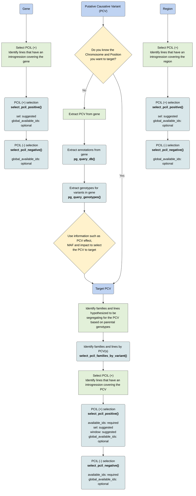

```mermaid
flowchart TD

%% =========================================================
%% MAIN GENOMIC TARGETS
%% =========================================================

PCV("Putative Causative Variant (PCV)")
GENE("Gene")
REGION("Region")

%% =========================================================
%% PCV BRANCH
%% =========================================================

PCV --> KNOW{"Do you know the Chromosome and Position<br/>you want to target?"}

KNOW -->|No| EXTRACT["Extract PCV from gene"]
KNOW -->|Yes| TARGET("Target PCV")

EXTRACT --> ANN("Extract annotations from gene<br/><b>pg_query_db()</b>")
ANN --> GENO("Extract genotypes for variants in gene<br/><b>pg_query_genotypes()</b>")

GENO --> CHOOSE{"Use information such as PCV effect,<br/>MAF and impact to select<br/>the PCV to target"}

CHOOSE --> TARGET

TARGET --> FAMSTEP["Identify families and lines hypothesized to be<br/>segregating for the PCV based on parental genotypes"]

FAMSTEP --> FAMFUNC("Identify families and lines by PCV(s)<br/><b>select_pcil_families_by_variant()</b>")

FAMFUNC --> PCPOSSTEP["Select PCIL (+)<br/>Identify lines that have an introgression covering the PCV"]

PCPOSSTEP --> PCPOSFUNC("PCIL (+) selection<br/><b>select_pcil_positive()</b><br/><br/>available_ids: required<br/>sel: suggested<br/>window: suggested<br/>global_available_ids: optional")

PCPOSFUNC --> PCNEGFUNC("PCIL (-) selection<br/><b>select_pcil_negative()</b><br/><br/>available_ids: required<br/>global_available_ids: optional")


%% =========================================================
%% GENE BRANCH
%% =========================================================

GENE --> GPOSSTEP["Select PCIL (+)<br/>Identify lines that have an introgression covering the gene"]

GPOSSTEP --> GPOSFUNC("PCIL (+) selection<br/><b>select_pcil_positive()</b><br/><br/>sel: suggested<br/>global_available_ids: optional")

GPOSFUNC --> GNEGFUNC("PCIL (-) selection<br/><b>select_pcil_negative()</b><br/><br/>global_available_ids: optional")


%% =========================================================
%% REGION BRANCH
%% =========================================================

REGION --> RPOSSTEP["Select PCIL (+)<br/>Identify lines that have an introgression covering the region"]

RPOSSTEP --> RPOSFUNC("PCIL (+) selection<br/><b>select_pcil_positive()</b><br/><br/>sel: suggested<br/>global_available_ids: optional")

RPOSFUNC --> RNEGFUNC("PCIL (-) selection<br/><b>select_pcil_negative()</b><br/><br/>global_available_ids: optional")


%% =========================================================
%% COLORS / SHAPES
%% =========================================================

classDef target fill:#BFD3F2,stroke:#606060,stroke-width:1px,color:#000;
classDef decision fill:#FFF2CC,stroke:#606060,stroke-width:1px,color:#000;
classDef step fill:#E2F0D9,stroke:#606060,stroke-width:1px,color:#000;
classDef function fill:#D9E7EA,stroke:#606060,stroke-width:1px,color:#000;

class PCV,GENE,REGION,TARGET target;
class KNOW,CHOOSE decision;
class EXTRACT,FAMSTEP,PCPOSSTEP,GPOSSTEP,RPOSSTEP step;
class ANN,GENO,FAMFUNC,PCPOSFUNC,PCNEGFUNC,GPOSFUNC,GNEGFUNC,RPOSFUNC,RNEGFUNC function;
```
