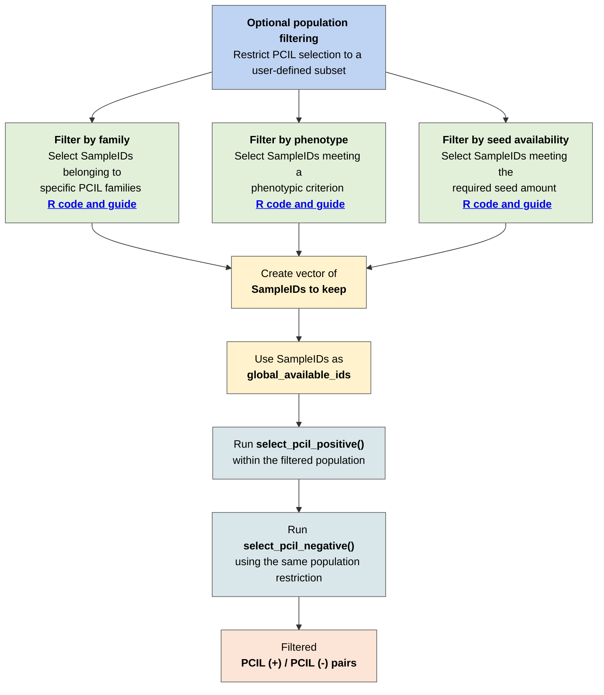
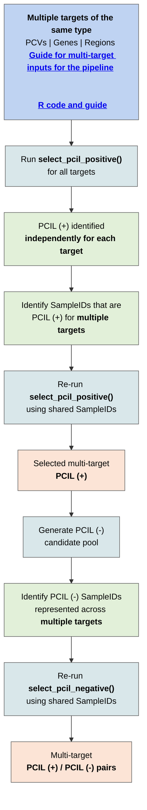
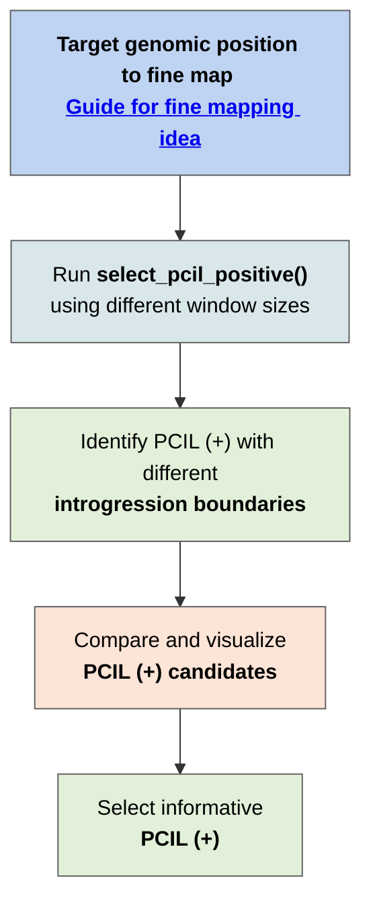

# PCIL Selection Pipeline

The **Pangenome Characterized Introgression Line (PCIL) Selection Pipeline** provides a workflow for identifying PCIL (+) and PCIL (−) pairs for genes, putative causative variants (PCVs), or genomic regions of interest.

PCIL (+) lines contain a donor introgression spanning the genomic target, while PCIL (−) lines are selected as genetically similar controls that do not contain the target introgression. The pipeline integrates PCIL introgression mapping, population metadata, genome-wide genetic similarity, and inbreeding information to support selection of informative PCIL pairs.

## Requirements

The workflow is implemented in **R** and uses functions from the PCIL selection pipeline together with the following packages:

```r
library(panGenomeBreedr)
library(dplyr)
library(tidyr)
library(ggplot2)
```

## Choosing a starting point

The pipeline can be entered using three types of genomic targets:

| Target | Use when |
|---|---|
| **PCV** | A specific putative causative variant is being targeted. If the chromosome and position of the PCV are not yet known, variant annotation and genotype information can first be used to identify the PCV from a candidate gene. |
| **Gene** | A candidate gene is known and the objective is to identify PCILs carrying an introgression spanning the gene. |
| **Region** | A genomic interval is known and the objective is to identify PCILs carrying an introgression spanning the defined region. |


## General workflow

Regardless of the starting target, the selection workflow ultimately identifies:

- **PCIL (+):** lines carrying a donor introgression spanning the target.
- **PCIL (−):** genetically similar lines selected as controls that do not carry the target introgression.

Optional filters and ranking parameters can be applied during selection to restrict the population based on factors such as **seed availability, phenotypic data availability, family membership, or other user-defined subsets**.

The diagram below provides the recommended workflow and links directly to the documentation for each function.

```mermaid
flowchart TD

%% =========================================================
%% MAIN TARGETS
%% =========================================================

PCV("Putative Causative Variant (PCV)")
GENE("Gene")
REGION("Region")

%% =========================================================
%% PCV BRANCH
%% =========================================================

PCV --> KNOW{"Do you know the <b>Chromosome</b> and <b>Position</b><br/>you want to target?"}

KNOW -->|No| EXTRACT["Extract PCV from gene<br/><a href='https://github.com/claracruet/PCIL_selection_pipeline/blob/main/PCV_from_gene_selection.md'><b>R code and guide</b></a>"]

KNOW -->|Yes| TARGET("Target PCV")

EXTRACT --> ANN("<b>Extract annotations</b><br/><b>from gene with:</b><br/><a href='https://awkena.github.io/panGenomeBreedr/articles/panGenomeBreedr_Workflows.html'><b>fetch_table_region()</b></a>")

ANN --> GENO("<b>Extract genotypes for variants in genes with:</b><br/><a href='https://awkena.github.io/panGenomeBreedr/articles/panGenomeBreedr_Workflows.html'><b>fetch_genotypes_by_id()</b></a>")

GENO --> CHOOSE{"Use information<br/>such as PCV <b>effect</b>,<br/><b>MAF</b> and <b>impact</b> to select<br/>the PCV to target"}

CHOOSE --> TARGET

TARGET --> FAMSTEP["Identify <b>families</b> and <b>lines</b> hypothesized to be segregating for the PCV based on<br/>parental genotypes<br/><a href='https://github.com/claracruet/PCIL_selection_pipeline/blob/main/pcv_to_pcil_pairs_pipeline_ReadMe.md'><b>R code and guide</b></a>"]

FAMSTEP --> FAMFUNC("<b>Identify families and lines by PCV(s)</b><br/><a href='https://github.com/claracruet/PCIL_selection_pipeline/blob/main/select_pcil_families_by_variant_ReadMe.md'><b>select_pcil_families_by_variant()</b></a>")

FAMFUNC --> PCPOSSTEP["<b>Select PCIL (+)/PCIL (-) pairs</b><br/>Identify lines that have an introgression covering the PCV [<b>PCIL (+)</b>]<br/>and lines genetically similar to the PCIL (+) but that do not have the introgression [<b>PCIL (-)</b>]<br/><a href='https://github.com/claracruet/PCIL_selection_pipeline/blob/main/pcv_to_pcil_pairs_pipeline_ReadMe.md'><b>R code and guide</b></a>"]

PCPOSSTEP --> PCDATA("<b>Load PCIL data</b><br/><a href='https://github.com/claracruet/PCIL_selection_pipeline/blob/main/load_pcil_data_ReadMe.md'><b>load_pcil_data()</b></a>")

PCDATA --> PCPOSFUNC("<b>PCIL (+) selection</b><br/><a href='https://github.com/claracruet/PCIL_selection_pipeline/blob/main/select_pcil_positive_ReadMe.md'><b>select_pcil_positive()</b></a><br/><i>• 'available_ids', required for PCV workflow<br/>• 'sel', suggested<br/>• 'window', suggested<br/>• 'global_available_ids', suggested for seed availability</i>")

PCPOSFUNC --> PCPOSPLOT("<b>Visualize PCIL (+)</b><br/><a href='https://github.com/claracruet/PCIL_selection_pipeline/blob/main/plotting_functions_ReadMe.md'><b>plot_all_pcil_positive()</b></a><br/><a href='https://github.com/claracruet/PCIL_selection_pipeline/blob/main/plotting_functions_ReadMe.md'><b>plot_best_pcil_positive()</b></a>")

PCPOSPLOT --> PCNEGFUNC("<b>PCIL (-) selection</b><br/><a href='https://github.com/claracruet/PCIL_selection_pipeline/blob/main/select_pcil_negative_ReadMe.md'><b>select_pcil_negative()</b></a><br/><i>• 'available_ids', required<br/>• 'global_available_ids', suggested for seed availability</i>")

PCNEGFUNC --> PCNEGPLOT("<b>Visualize PCIL (+)/PCIL (-) pairs</b><br/><a href='https://github.com/claracruet/PCIL_selection_pipeline/blob/main/plotting_functions_ReadMe.md'><b>plot_pcil_pairs()</b></a>")


%% =========================================================
%% GENE BRANCH
%% =========================================================

GENE --> GPOSSTEP["<b>Select PCIL (+)/PCIL (-) pairs</b><br/>Identify lines that have an introgression covering the gene [<b>PCIL (+)</b>]<br/>and lines genetically similar to the PCIL (+) but that do not have the introgression [<b>PCIL (-)</b>]<br/><a href='https://github.com/claracruet/PCIL_selection_pipeline/blob/main/gene_to_pcil_branch.md'><b>R code and guide</b></a>"]

GPOSSTEP --> GDATA("<b>Load PCIL data</b><br/><a href='https://github.com/claracruet/PCIL_selection_pipeline/blob/main/load_pcil_data_ReadMe.md'><b>load_pcil_data()</b></a>")

GDATA --> GPOSFUNC("<b>PCIL (+) selection</b><br/><a href='https://github.com/claracruet/PCIL_selection_pipeline/blob/main/select_pcil_positive_ReadMe.md'><b>select_pcil_positive()</b></a><br/><i>• 'sel', suggested<br/>• 'global_available_ids', suggested for seed availability</i>")

GPOSFUNC --> GPOSPLOT("<b>Visualize PCIL (+)</b><br/><a href='https://github.com/claracruet/PCIL_selection_pipeline/blob/main/plotting_functions_ReadMe.md'><b>plot_all_pcil_positive()</b></a><br/><a href='https://github.com/claracruet/PCIL_selection_pipeline/blob/main/plotting_functions_ReadMe.md'><b>plot_best_pcil_positive()</b></a>")

GPOSPLOT --> GNEGFUNC("<b>PCIL (-) selection</b><br/><a href='https://github.com/claracruet/PCIL_selection_pipeline/blob/main/select_pcil_negative_ReadMe.md'><b>select_pcil_negative()</b></a><br/><i>• 'global_available_ids', suggested for seed availability</i>")

GNEGFUNC --> GNEGPLOT("<b>Visualize PCIL (+)/PCIL (-) pairs</b><br/><a href='https://github.com/claracruet/PCIL_selection_pipeline/blob/main/plotting_functions_ReadMe.md'><b>plot_pcil_pairs()</b></a>")


%% =========================================================
%% REGION BRANCH
%% =========================================================

REGION --> RPOSSTEP["<b>Select PCIL (+)/PCIL (-) pairs</b><br/>Identify lines that have an introgression covering the region [<b>PCIL (+)</b>]<br/>and lines genetically similar to the PCIL (+) but that do not have the introgression [<b>PCIL (-)</b><a href='https://github.com/claracruet/PCIL_selection_pipeline/blob/main/Region_to_PCIL.md'><b>R code and guide</b></a>]"]

RPOSSTEP --> RDATA("<b>Load PCIL data</b><br/><a href='https://github.com/claracruet/PCIL_selection_pipeline/blob/main/load_pcil_data_ReadMe.md'><b>load_pcil_data()</b></a>")

RDATA --> RPOSFUNC("<b>PCIL (+) selection</b><br/><a href='https://github.com/claracruet/PCIL_selection_pipeline/blob/main/select_pcil_positive_ReadMe.md'><b>select_pcil_positive()</b></a><br/><i>• 'sel', suggested<br/>• 'global_available_ids', suggested for seed availability</i>")

RPOSFUNC --> RPOSPLOT("<b>Visualize PCIL (+)</b><br/><a href='https://github.com/claracruet/PCIL_selection_pipeline/blob/main/plotting_functions_ReadMe.md'><b>plot_all_pcil_positive()</b></a><br/><a href='https://github.com/claracruet/PCIL_selection_pipeline/blob/main/plotting_functions_ReadMe.md'><b>plot_best_pcil_positive()</b></a>")

RPOSPLOT --> RNEGFUNC("<b>PCIL (-) selection</b><br/><a href='https://github.com/claracruet/PCIL_selection_pipeline/blob/main/select_pcil_negative_ReadMe.md'><b>select_pcil_negative()</b></a><br/><i>• 'global_available_ids', suggested for seed availability</i>")

RNEGFUNC --> RNEGPLOT("<b>Visualize PCIL (+)/PCIL (-) pairs</b><br/><a href='https://github.com/claracruet/PCIL_selection_pipeline/blob/main/plotting_functions_ReadMe.md'><b>plot_pcil_pairs()</b></a>")


%% =========================================================
%% STYLES
%% =========================================================

classDef target fill:#BFD3F2,stroke:#606060,stroke-width:1px,color:#000;
classDef decision fill:#FFF2CC,stroke:#606060,stroke-width:1px,color:#000;
classDef step fill:#E2F0D9,stroke:#606060,stroke-width:1px,color:#000;
classDef function fill:#D9E7EA,stroke:#606060,stroke-width:1px,color:#000;
classDef plot fill:#FCE4D6,stroke:#606060,stroke-width:1px,color:#000;

class PCV,GENE,REGION,TARGET target;
class KNOW,CHOOSE decision;
class EXTRACT,FAMSTEP,PCPOSSTEP,GPOSSTEP,RPOSSTEP step;
class ANN,GENO,FAMFUNC,PCDATA,GDATA,RDATA,PCPOSFUNC,PCNEGFUNC,GPOSFUNC,GNEGFUNC,RPOSFUNC,RNEGFUNC function;
class PCPOSPLOT,PCNEGPLOT,GPOSPLOT,GNEGPLOT,RPOSPLOT,RNEGPLOT plot;
```





## Optional population filtering

PCIL (+) and PCIL (−) selection can be restricted to a user-defined subset of the PCIL population. For example, lines can be filtered based on **family membership**, **phenotypic criteria**, or **seed availability**. The SampleIDs that meet the desired criterion are provided through `global_available_ids`, restricting the population considered during selection. The same population restriction should be applied to both PCIL (+) and PCIL (−) selection.



## Multiple target selection

The pipeline can evaluate **multiple targets of the same type** in a single analysis. Multiple PCVs, genes, or genomic regions can be supplied together, while each target is evaluated independently throughout PCIL (+) and PCIL (-) selection.

Multi-target analysis can also be used to identify **shared PCILs across targets**. After identifying candidates independently for each target, SampleIDs represented across multiple targets can be used to restrict the population and prioritize PCIL (+) and PCIL (-) lines that are informative for more than one target.




### Fine mapping

PCIL (+) lines with different introgression boundaries around a target can be used to identify informative material for fine mapping. Comparing introgression boundaries identifies informative PCIL material; phenotypic evaluation of the corresponding PCIL (+)/PCIL (-) contrasts is required to support refinement of the candidate interval. The target can be evaluated using progressively larger windows to identify PCILs carrying different amounts of donor sequence around the region of interest. Selected PCIL (+) lines can then be paired with genetically similar PCIL (-) controls for phenotypic evaluation.


