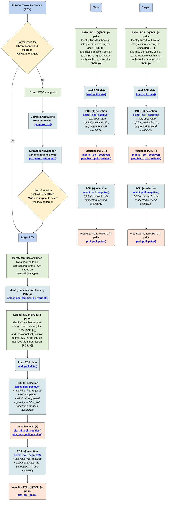

```mermaid
flowchart TD

%% =========================================================
%% MAIN TARGETS
%% =========================================================

PCV("Putative Causative Variant (PCV)")
GENE("Gene")
REGION("Region")

%% =========================================================
%% PCV BRANCH
%% =========================================================

PCV --> KNOW{"Do you know the <b>Chromosome</b> and <b>Position</b><br/>you want to target?"}

KNOW -->|No| EXTRACT["Extract PCV from gene"]
KNOW -->|Yes| TARGET("Target PCV")

EXTRACT --> ANN("<b>Extract annotations</b><br/><b>from gene with:</b><br/><a href='https://awkena.github.io/panGenomeBreedr/articles/panGenomeBreedr_Workflows.html'><b>pg_query_db()</b></a>")

ANN --> GENO("<b>Extract genotypes for variants in genes with:</b><br/><a href='https://awkena.github.io/panGenomeBreedr/articles/panGenomeBreedr_Workflows.html'><b>pg_query_genotypes()</b></a>")

GENO --> CHOOSE{"Use information<br/>such as PCV <b>effect</b>,<br/><b>MAF</b> and <b>impact</b> to select<br/>the PCV to target"}

CHOOSE --> TARGET

TARGET --> FAMSTEP["Identify <b>families</b> and <b>lines</b> hypothesized to be segregating for the PCV based on<br/>parental genotypes"]

FAMSTEP --> FAMFUNC("<b>Identify families and lines by PCV(s)</b><br/><a href='https://github.com/claracruet/PCIL_selection_pipeline/blob/main/select_pcil_families_by_variant_ReadMe.md'><b>select_pcil_families_by_variant()</b></a>")

FAMFUNC --> PCPOSSTEP["<b>Select PCIL (+)/PCIL (-) pairs</b><br/>Identify lines that have an introgression covering the PCV [<b>PCIL (+)</b>]<br/>and lines genetically similar to the PCIL (+) but that do not have the introgression [<b>PCIL (-)</b>]"]

PCPOSSTEP --> PCDATA("<b>Load PCIL data</b><br/><a href='https://github.com/claracruet/PCIL_selection_pipeline/blob/main/load_pcil_data_ReadMe.md'><b>load_pcil_data()</b></a>")

PCDATA --> PCPOSFUNC("<b>PCIL (+) selection</b><br/><a href='https://github.com/claracruet/PCIL_selection_pipeline/blob/main/select_pcil_positive_ReadMe.md'><b>select_pcil_positive()</b></a><br/><i>• 'available_ids', required<br/>• 'sel', suggested<br/>• 'window', suggested<br/>• 'global_available_ids', suggested for seed availability</i>")

PCPOSFUNC --> PCPOSPLOT("<b>Visualize PCIL (+)</b><br/><a href='https://github.com/claracruet/PCIL_selection_pipeline/blob/main/plotting_functions_ReadMe.md'><b>plot_all_pcil_positive()</b></a><br/><a href='https://github.com/claracruet/PCIL_selection_pipeline/blob/main/plotting_functions_ReadMe.md'><b>plot_best_pcil_positive()</b></a>")

PCPOSPLOT --> PCNEGFUNC("<b>PCIL (-) selection</b><br/><a href='https://github.com/claracruet/PCIL_selection_pipeline/blob/main/select_pcil_negative_ReadMe.md'><b>select_pcil_negative()</b></a><br/><i>• 'available_ids', required<br/>• 'global_available_ids', suggested for seed availability</i>")

PCNEGFUNC --> PCNEGPLOT("<b>Visualize PCIL (+)/PCIL (-) pairs</b><br/><a href='https://github.com/claracruet/PCIL_selection_pipeline/blob/main/plotting_functions_ReadMe.md'><b>plot_pcil_pairs()</b></a>")


%% =========================================================
%% GENE BRANCH
%% =========================================================

GENE --> GPOSSTEP["<b>Select PCIL (+)/PCIL (-) pairs</b><br/>Identify lines that have an introgression covering the gene [<b>PCIL (+)</b>]<br/>and lines genetically similar to the PCIL (+) but that do not have the introgression [<b>PCIL (-)</b>]"]

GPOSSTEP --> GDATA("<b>Load PCIL data</b><br/><a href='https://github.com/claracruet/PCIL_selection_pipeline/blob/main/load_pcil_data_ReadMe.md'><b>load_pcil_data()</b></a>")

GDATA --> GPOSFUNC("<b>PCIL (+) selection</b><br/><a href='https://github.com/claracruet/PCIL_selection_pipeline/blob/main/select_pcil_positive_ReadMe.md'><b>select_pcil_positive()</b></a><br/><i>• 'sel', suggested<br/>• 'global_available_ids', suggested for seed availability</i>")

GPOSFUNC --> GPOSPLOT("<b>Visualize PCIL (+)</b><br/><a href='https://github.com/claracruet/PCIL_selection_pipeline/blob/main/plotting_functions_ReadMe.md'><b>plot_all_pcil_positive()</b></a><br/><a href='https://github.com/claracruet/PCIL_selection_pipeline/blob/main/plotting_functions_ReadMe.md'><b>plot_best_pcil_positive()</b></a>")

GPOSPLOT --> GNEGFUNC("<b>PCIL (-) selection</b><br/><a href='https://github.com/claracruet/PCIL_selection_pipeline/blob/main/select_pcil_negative_ReadMe.md'><b>select_pcil_negative()</b></a><br/><i>• 'global_available_ids', suggested for seed availability</i>")

GNEGFUNC --> GNEGPLOT("<b>Visualize PCIL (+)/PCIL (-) pairs</b><br/><a href='https://github.com/claracruet/PCIL_selection_pipeline/blob/main/plotting_functions_ReadMe.md'><b>plot_pcil_pairs()</b></a>")


%% =========================================================
%% REGION BRANCH
%% =========================================================

REGION --> RPOSSTEP["<b>Select PCIL (+)/PCIL (-) pairs</b><br/>Identify lines that have an introgression covering the region [<b>PCIL (+)</b>]<br/>and lines genetically similar to the PCIL (+) but that do not have the introgression [<b>PCIL (-)</b>]"]

RPOSSTEP --> RDATA("<b>Load PCIL data</b><br/><a href='https://github.com/claracruet/PCIL_selection_pipeline/blob/main/load_pcil_data_ReadMe.md'><b>load_pcil_data()</b></a>")

RDATA --> RPOSFUNC("<b>PCIL (+) selection</b><br/><a href='https://github.com/claracruet/PCIL_selection_pipeline/blob/main/select_pcil_positive_ReadMe.md'><b>select_pcil_positive()</b></a><br/><i>• 'sel', suggested<br/>• 'global_available_ids', suggested for seed availability</i>")

RPOSFUNC --> RPOSPLOT("<b>Visualize PCIL (+)</b><br/><a href='https://github.com/claracruet/PCIL_selection_pipeline/blob/main/plotting_functions_ReadMe.md'><b>plot_all_pcil_positive()</b></a><br/><a href='https://github.com/claracruet/PCIL_selection_pipeline/blob/main/plotting_functions_ReadMe.md'><b>plot_best_pcil_positive()</b></a>")

RPOSPLOT --> RNEGFUNC("<b>PCIL (-) selection</b><br/><a href='https://github.com/claracruet/PCIL_selection_pipeline/blob/main/select_pcil_negative_ReadMe.md'><b>select_pcil_negative()</b></a><br/><i>• 'global_available_ids', suggested for seed availability</i>")

RNEGFUNC --> RNEGPLOT("<b>Visualize PCIL (+)/PCIL (-) pairs</b><br/><a href='https://github.com/claracruet/PCIL_selection_pipeline/blob/main/plotting_functions_ReadMe.md'><b>plot_pcil_pairs()</b></a>")


%% =========================================================
%% STYLES
%% =========================================================

classDef target fill:#BFD3F2,stroke:#606060,stroke-width:1px,color:#000;
classDef decision fill:#FFF2CC,stroke:#606060,stroke-width:1px,color:#000;
classDef step fill:#E2F0D9,stroke:#606060,stroke-width:1px,color:#000;
classDef function fill:#D9E7EA,stroke:#606060,stroke-width:1px,color:#000;
classDef plot fill:#FCE4D6,stroke:#606060,stroke-width:1px,color:#000;

class PCV,GENE,REGION,TARGET target;
class KNOW,CHOOSE decision;
class EXTRACT,FAMSTEP,PCPOSSTEP,GPOSSTEP,RPOSSTEP step;
class ANN,GENO,FAMFUNC,PCDATA,GDATA,RDATA,PCPOSFUNC,PCNEGFUNC,GPOSFUNC,GNEGFUNC,RPOSFUNC,RNEGFUNC function;
class PCPOSPLOT,PCNEGPLOT,GPOSPLOT,GNEGPLOT,RPOSPLOT,RNEGPLOT plot;
```
