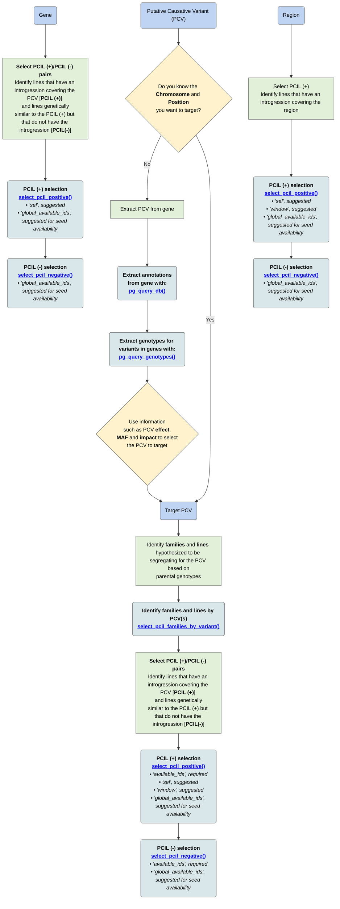

```mermaid
flowchart TD

%% =========================================================
%% MAIN TARGETS
%% =========================================================

PCV("Putative Causative Variant (PCV)")
GENE("Gene")
REGION("Region")

%% =========================================================
%% PCV BRANCH
%% =========================================================

PCV --> KNOW{"Do you know the <b>Chromosome</b> and <b>Position</b><br/>you want to target?"}

KNOW -->|No| EXTRACT["Extract PCV from gene"]
KNOW -->|Yes| TARGET("Target PCV")

EXTRACT --> ANN("<b>Extract annotations</b><br/><b>from gene with:</b><br/><a href='YOUR_PG_QUERY_DB_LINK'><b>pg_query_db()</b></a>")

ANN --> GENO("<b>Extract genotypes for variants in genes with:</b><br/><a href='YOUR_PG_QUERY_GENOTYPES_LINK'><b>pg_query_genotypes()</b></a>")

GENO --> CHOOSE{"Use information<br/>such as PCV <b>effect</b>,<br/><b>MAF</b> and <b>impact</b> to select<br/>the PCV to target"}

CHOOSE --> TARGET

TARGET --> FAMSTEP["Identify <b>families</b> and <b>lines</b> hypothesized to be segregating for the PCV based on<br/>parental genotypes"]

FAMSTEP --> FAMFUNC("<b>Identify families and lines by PCV(s)</b><br/><a href='YOUR_FAMILY_SELECTION_README_LINK'><b>select_pcil_families_by_variant()</b></a>")

FAMFUNC --> PCPOSSTEP["<b>Select PCIL (+)/PCIL (-) pairs</b><br/>Identify lines that have an introgression covering the PCV [<b>PCIL (+)</b>] <br/> and lines genetically similar to the PCIL (+) but that do not have the introgression [<b>PCIL(-)</b>]"]

PCPOSSTEP --> PCPOSFUNC("<b>PCIL (+) selection</b><br/><a href='YOUR_PCIL_POSITIVE_README_LINK'><b>select_pcil_positive()</b></a><br/><span style='color:red'><i>• 'available_ids', required<br/>• 'sel', suggested<br/>• 'window', suggested<br/>• 'global_available_ids', suggested for seed availability</i></span>")

PCPOSFUNC --> PCNEGFUNC("<b>PCIL (-) selection</b><br/><a href='YOUR_PCIL_NEGATIVE_README_LINK'><b>select_pcil_negative()</b></a><br/><span style='color:red'><i>• 'available_ids', required<br/>• 'global_available_ids', suggested for seed availability</i></span>")

%% =========================================================
%% GENE BRANCH
%% =========================================================

GENE --> GPOSSTEP["<b>Select PCIL (+)/PCIL (-) pairs</b><br/>Identify lines that have an introgression covering the PCV [<b>PCIL (+)</b>] <br/> and lines genetically similar to the PCIL (+) but that do not have the introgression [<b>PCIL(-)</b>]"]

GPOSSTEP --> GPOSFUNC("<b>PCIL (+) selection</b><br/><a href='YOUR_PCIL_POSITIVE_README_LINK'><b>select_pcil_positive()</b></a><br/><span style='color:red'><i>• 'sel', suggested<br/>• 'global_available_ids', suggested for seed availability</i></span>")

GPOSFUNC --> GNEGFUNC("<b>PCIL (-) selection</b><br/><a href='YOUR_PCIL_NEGATIVE_README_LINK'><b>select_pcil_negative()</b></a><br/><span style='color:red'><i>• 'global_available_ids', suggested for seed availability</i></span>")

%% =========================================================
%% REGION BRANCH
%% =========================================================

REGION --> RPOSSTEP["Select PCIL (+)<br/>Identify lines that have an introgression covering the region"]

RPOSSTEP --> RPOSFUNC("<b>PCIL (+) selection</b><br/><a href='YOUR_PCIL_POSITIVE_README_LINK'><b>select_pcil_positive()</b></a><br/><span style='color:red'><i>• 'sel', suggested<br/>• 'window', suggested<br/>• 'global_available_ids', suggested for seed availability</i></span>")

RPOSFUNC --> RNEGFUNC("<b>PCIL (-) selection</b><br/><a href='YOUR_PCIL_NEGATIVE_README_LINK'><b>select_pcil_negative()</b></a><br/><span style='color:red'><i>• 'global_available_ids', suggested for seed availability</i></span>")

%% =========================================================
%% STYLES
%% =========================================================

classDef target fill:#BFD3F2,stroke:#606060,stroke-width:1px,color:#000;
classDef decision fill:#FFF2CC,stroke:#606060,stroke-width:1px,color:#000;
classDef step fill:#E2F0D9,stroke:#606060,stroke-width:1px,color:#000;
classDef function fill:#D9E7EA,stroke:#606060,stroke-width:1px,color:#000;

class PCV,GENE,REGION,TARGET target;
class KNOW,CHOOSE decision;
class EXTRACT,FAMSTEP,PCPOSSTEP,GPOSSTEP,RPOSSTEP step;
class ANN,GENO,FAMFUNC,PCPOSFUNC,PCNEGFUNC,GPOSFUNC,GNEGFUNC,RPOSFUNC,RNEGFUNC function;
```
