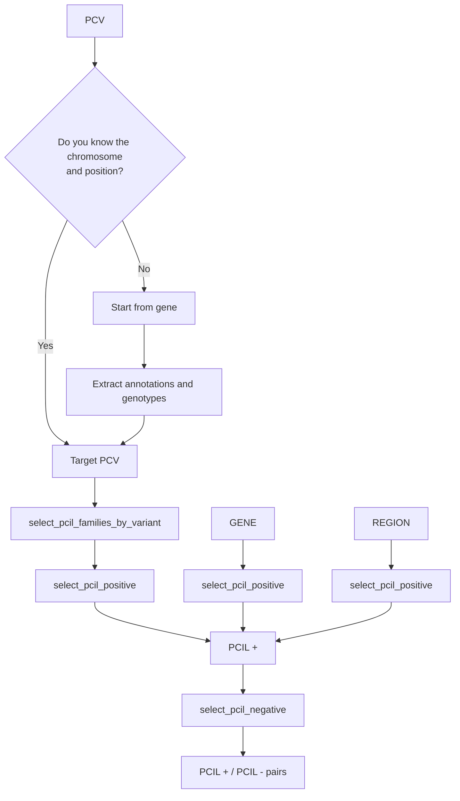

```mermaid
flowchart TD

    A[PCV] --> D{Do you know the chromosome<br/>and position?}
    B[GENE] --> G[select_pcil_positive]
    C[REGION] --> R[select_pcil_positive]

    D -->|Yes| P[Target PCV]
    D -->|No| E[Start from gene]
    E --> F[Extract annotations and genotypes]
    F --> P

    P --> H[select_pcil_families_by_variant]
    H --> I[select_pcil_positive]

    I --> J[PCIL +]
    G --> J
    R --> J

    J --> K[select_pcil_negative]
    K --> L[PCIL + / PCIL - pairs]

    click H "YOUR_LINK_HERE" "Open function documentation"
    click I "YOUR_LINK_HERE" "Open function documentation"
    click G "YOUR_LINK_HERE" "Open function documentation"
    click R "YOUR_LINK_HERE" "Open function documentation"
    click K "YOUR_LINK_HERE" "Open function documentation"
```
